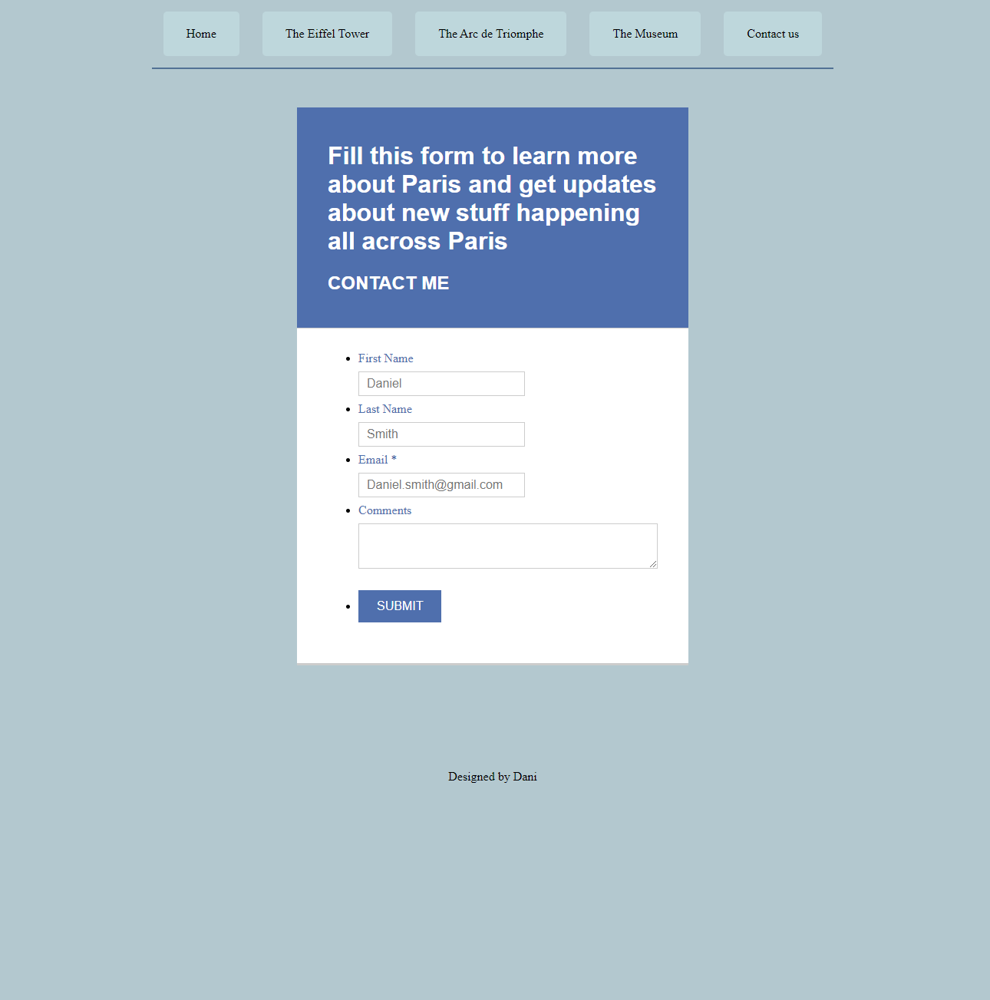
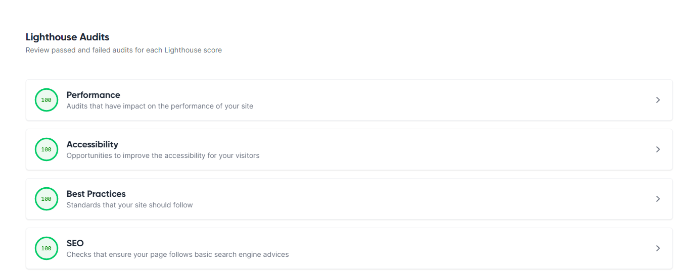

# Mags Foundation
[live project on Github](https://dani1157.github.io/Paris1/)

# Parisian Landmarks Website

## Overview
This project aims to showcase information about iconic landmarks in Paris, including the Eiffel Tower, the Grand Louvre, and the Arc de Triomphe. The website is designed using HTML, CSS, and JavaScript, following the principles of user experience design, accessibility, and responsiveness. The website provides an interactive and informative experience for users interested in Parisian landmarks.

# Table of Contents
1. [UX](#user-experience-ux) 
    - [New User](#new-user)
    - [Old User](#old-user)
2. [Design](#design) 
    - [Wireframes](#wireframes)
3. [Deployment](#deployment) 
4. [Features](#features)

5. [Testing](#testing)
    - [Features Testing](#features-testing)
    - [Browser Testing](#browser-testing)
    - [Responsiveness](#responsiveness)
    - [Responsive testing](#responsive-testing)

6.   [Code Validation](#code-validation) 
      - [HTML Validation](#html-validation)
      - [CSS Validation](#html-validation) 

7.   [Lighthouse Test](#lighthouse-test) 

8.   [Libraries and Programs](#libraries-and-programs) 

9.   [Technologies Used](#technologies-used) 
    

10.   [Credits & Reference](#credits) 
      - [Code Used](#code-used)

11. [Acknowledgements](#acknowledgements)

# User experience (UX)

the reason behind this website is  website is to provide people with information about Paris landmarks.

# New User
- As a first-time user of the website, I want to:

 - Navigate through the website easily and find relevant sections quickly.
 - Access all important information conveniently in a single-page format.
 - Get detailed information about Paris and its landmarks.
 - Have the option to contact me by submitting a form for inquiries about Paris.
# Old User
As a returning user, I want to:
Check out upcoming events and new information about Paris.
# Design
The website is designed with a 4-page layout, making it easy to navigate and providing smooth transitions between pages. 
# Wireframes

## Features
### Home (Index.html)
- Provides an introduction to the beauty of Paris.
- Describes the cultural significance and attractions of the city.
## Navigation Bar
- The website includes a fully responsive navigation bar with links to different pages like the Museum, Eiffel Tower, Arc de Triomphe, and Contact Us. It provides easy access to navigate through the website on various devices. 

## The landing page
- The landing includes informative section about Paris, highlighting its significance as the capital of France.
- Details about Paris's culture, history, attractions like the Eiffel Tower, Louvre Museum, and more are provided.

## Footer Section
- The footer section of the website contains social media icons linking to Instagram, Twitter, YouTube, and GitHub accounts for enhanced engagement and connectivity.
Users can easily access the website's social media platforms by clicking on the respective icons.
- The footer also includes copyright information, denoting the year of creation (©2024) and the designer's name (Dani) for attributing credit.
- This footer design provides a professional and polished conclusion to the webpage, enhancing the overall user experience.

### Eiffel Tower Page (eiffelTower.html)
- Detailed information about the Eiffel Tower, including construction details and history.
- Image gallery showcasing memorable pictures of the Eiffel Tower.

- The navigation bar contains links to different pages related to Paris, such as "The Museum", "The Eiffel Tower", "The Arc de Triomphe", and "Contact Us".
-It includes a burger menu icon (burger-menu) that, when clicked, toggles the visibility of the links within the navbar.

## The landing page 
- The landing includes Information about the Eiffel Tower" prominently to inform visitors about the main focus of the content.
- Content Section: Provides information about the Eiffel Tower, including facts like the number of rivets used, tower height, and construction details. This section educates visitors about the iconic structure.
- Images Section: Features memorable pictures from the construction of the Eiffel Tower with corresponding captions linking to external sources for further exploration.

## Footer Section
- The footer section of the website contains social media icons linking to Instagram, Twitter, YouTube, and GitHub accounts for enhanced engagement and connectivity.
Users can easily access the website's social media platforms by clicking on the respective icons.
- The footer also includes copyright information, denoting the year of creation (©2024) and the designer's name (Dani) for attributing credit.
- This footer design provides a professional and polished conclusion to the webpage, enhancing the overall user experience.

### Arc de Triomphe Page (triomphe.html)
- Overview of the Arc de Triomphe, historical context, and significance.
- Interesting facts and memorable events associated with the monument.
- The navigation bar contains links to the Home page, Eiffel Tower page, Museum page, and Contact Us page. It includes a burger menu icon for mobile responsiveness.

## The landing page
 -The landing includes the Arc de Triomphe in Paris and provides a captivating introduction to the monumental landmark. It features a striking image of the Arc de Triomphe, accompanied by essential information about its historical significance and construction. The page highlights key details such as the monument's tribute to fallen heroes of France, its architectural inspiration from ancient Roman design, and notable events that have taken place at the site.

## Footer Section
- The footer section of the website contains social media icons linking to Instagram, Twitter, YouTube, and GitHub accounts for enhanced engagement and connectivity.
Users can easily access the website's social media platforms by clicking on the respective icons.
- The footer also includes copyright information, denoting the year of creation (©2024) and the designer's name (Dani) for attributing credit.
- This footer design provides a professional and polished conclusion to the webpage, enhancing the overall user experience.

### Louvre Museum Page (museum.html)
- Information about The Louvre museum, iconic artworks, and historical background.
- Image gallery featuring famous artworks housed in The Louvre.
- The navigation bar contains links to the Home page, Eiffel Tower page, The Arc de Triomphe and Contact Us page. It includes a burger menu icon for mobile responsiveness.

- The landing page for the Louvre Museum includes information about the iconic museum in Paris, offering a captivating introduction to its vast collection and historical significance. It features a stunning image of the Louvre Museum and provides essential details about its history, architecture, and famous artworks housed within. The page highlights key aspects such as the museum's renowned art collections, its evolution from a royal palace to a cultural institution, and notable events or exhibitions that have taken place at the museum.

## Footer Section
- The footer section of the website contains social media icons linking to Instagram, Twitter, YouTube, and GitHub accounts for enhanced engagement and connectivity.
Users can easily access the website's social media platforms by clicking on the respective icons.
- The footer also includes copyright information, denoting the year of creation (©2024) and the designer's name (Dani) for attributing credit.
- This footer design provides a professional and polished conclusion to the webpage, enhancing the overall user experience.

## Contact page

- It allows users To get in contact with me And ask questions And get updates about Paris.
Users can also reach out for recommendations on places to visit, things to do, and where to eat in Paris. I also provide insider tips and insights on the best ways to experience the city like a local. Additionally, users can inquire about upcoming events, festivals, and special promotions happening in Paris. Stay connected with me for all the latest news and information about the City of Light!
## Technologies Used
- **HTML:** Used for creating the structure and content of the website.
- **CSS:** Used for styling and design elements of the website.
- **JavaScript:** Used for adding interactive elements and dynamic features to the website.
## Design Principles
- **Navigation Menu:** Main navigation menu for easy access to different sections.
- **Accessibility Guidelines:** Ensuring proper contrast and alt text for visually impaired users.
- **Organisation of Information:** Structured layout using headers for clear information hierarchy.
- **Design Consistency:** Graphics are consistent in style, color, and layout.
- **User Interaction:** Providing user-initiated actions such as navigation and multimedia playback.
## Deployment
- Select project, go to the Settings tab of your GitHub repository.
On the left-hand > under Code and automation section, select Pages.
under build and deployment >set Source to 'Deploy from Branch'. Main branch is selected. Folder is set to / (root).Under Branch, click Save.Go back to the Code tab. Wait a few minutes for the build to finish and refresh your repo.On the right-hand side, in the Environments section, click on 'Github-pages'.
- **Cloud Platform:** The website is deployed on a cloud-based hosting platform for accessibility.
- **Version Control:** Git and GitHub used for version control up to deployment.
- **Broken Links:** No broken internal links in the deployed version.
## Development and Testing
- **Validation:** Custom HTML and CSS code pass official validators with no issues.
- **Images:** High-resolution images included to maintain quality. Image credits are properly attributed.
- **External Links:** All external links open in a separate tab.
- **Responsiveness:** CSS media queries used for responsive design across different devices.
- **Semantic Markup:** Structured HTML code follows semantic markup for better SEO.
# CodeValidation
## HTML Validation

## CSS Validation

## Lighthouse Test

Overall website Lighthouse score

# Libraries and Programs
- Used Visual Studio Code as editor.
- Used Font Awesome for the social media icons.
- Used GitHub as version control to add, commit and push to repository.
- Used Google fonts to traget elements font style.
- Used Microsoft Word for wireframes.
- Google Chrome.
- MS Edge (For testing purpose).
- Firefox (For testing purpose).

# Testing:
## Features Testing
All th feaures of the website have been tested to make sure it working as designed.

<table>
  <thead>
    <tr>
      <th>Feature</th>
      <th>Test case</th>
      <th>outcome</th>
    </tr>
  </thead>
  <tbody>
    <tr>
      <td>Navbar|the Museum </td>
      <td>click on The Museum link</td>
      <td>This brings the user to the Museum</td>
    </tr>
    <tr>
      <td>Navbar|The Eiffel Tower</td>
      <td>click on the Eiffel Tower link</td>
      <td>This brings the user to the Eiffel Tower section/pass</td>
    </tr>
    <tr>
      <td>Navbar|The Arc de Triomphe</td>
       <td>click on the Arc de Triomphe link</td>
      <td>This brings the user to the Arc de Triomphe section/pass</td>
    </tr>
    <tr>
       <td>Navbar| Contact us </td>
       <td>click on Contact link/ this brings the user to contact section. user tried to submit a form without filling all the required fields</td>
      <td>This brings user was to fill the required field before submitting the form/ pass</td>
    </tr>
    <tr>
      <td>social media icons</td>
       <td>click on icons link</td>
      <td>this open new page and brings the user to our social media pages/ pass</td>
    </tr>
  </tbody>
</table>

## Browser Testing
Website is tested acrossed below browsers to check performance
<table>
  <thead>
    <tr>
      <th>Tested browser</th>
      <th>Appearance</th>
      <th>Responsiveness</th>
    </tr>
  </thead>
  <tbody>
    <tr>
      <td>Chrome</td>
      <td>All the links, form, button appears good</td>
      <td>responsive design/ Good</td>
    </tr>
    <tr>
       <td>Edge</td>
      <td>All the links, form, button appears good</td>
      <td>responsive design / Good</td>
    </tr>
    <tr>
      <td>Firefox</td>
      <td>All the links, form, button appears good</td>
      <td>responsive design/ Good</td>
    </tr>
 
  </tbody>
</table>

##  Responsiveness
Website is tested acrossed below browsers to check performance
<table>
  <thead>
    <tr>
      <th>Tested device</th>
      <th>Appearance</th>
      <th>Responsiveness</th>
    </tr>
  </thead>
  <tbody>
    <tr>
      <td>Chrome</td>
      <td>All the links, form, button appears good</td>
      <td>responsive design/ Good</td>
    </tr>
    <tr>
       <td>Edge</td>
      <td>All the links, form, button appears good</td>
      <td>responsive design / Good</td>
    </tr>
    <tr>
      <td>Firefox</td>
      <td>All the links, form, button appears good</td>
      <td>responsive design/ Good</td>
    </tr>
 
  </tbody>
</table>

## Responsive testing
<table>
  <thead>
    <tr>
      <th>Tested Device</th>
      <th>Site responsive  min-width: 600px</th>
       <th>Site responsive min-width: 768px</th>
        <th>Site responsive min-width: 992px600px</th>
    </tr>
  </thead>
  <tbody>
    <tr>
      <td>Samsung s24 ultra</td>
      <td>Good/ nav Links are hiden. Menu icon display</td>
      <td>N/A</td>
      <td>N/A</td>
    </tr>
    <tr>
       <td>ipad tablet</td>
      <td>N/A</td>
      <td>Good/ nav Links are displayed</td>
      <td>N/A</td>
    </tr>
    <tr>
       <td>nest hub larger screen</td>
      <td>N/A</td>
      <td>N/A</td>
      <td>Good/ nav Links are displayed</td>
    </tr>
 
  </tbody>
</table>

### performance 
* was less than 90%. I reduced image width to 600px and this improves the overall preformance and accessibility. 

## Future Improvements
- Implement an interactive map for users to visually explore Parisian landmarks.
- Add a search functionality for users to quickly find specific information.
- Enhance user interaction with more dynamic features and multimedia elements.
## Acknowledgement
This project is inspired by the beauty and history of Parisian landmarks, with a goal to educate and engage users in an immersive web experience.
---
## Credits
**Credits for Web Content:**
**Eiffel Tower Page:**
Information about the Eiffel Tower sourced from Wikipedia - Eiffel Tower
Images of Eiffel Tower sourced from official sources and credited accordingly
**Paris Page:**
Information about Paris sourced from Wikipedia - Paris
Images of Paris sourced from official sources and credited accordingly
**The Louvre Museum Page:**
Information about The Louvre Museum sourced from Wikipedia - Louvre Museum
Images of artworks and The Louvre sourced from official sources and credited accordingly
**Arc de Triomphe Page:**
Information about Arc de Triomphe sourced from Wikipedia - Arc de Triomphe
Images of Arc de Triomphe sourced from official sources and credited accordingly
### Images Credits
-Images of the Arc de Triomphe sourced from photographer Emilie Bickerton (source: Apollo Magazine - Arc de Triomphe View Paris Tourism)
- Images of the Eiffel Tower under construction sourced from Getty Images (source: 40 Fascinating Facts About the Eiffel Tower - Patabook)
- Image of "La Liberté guidant le peuple" by Delacroix sourced from the Louvre Museum (source: Top 20 Oeuvres Incontournables Louvre - Paris City Vision)
- Image of the Mona Lisa sourced from Gallery Film Pictures
- Vintage image of the Eiffel Tower sourced from Wallpaper Safari
- Historical images of Eiffel Tower construction and Alexandre Gustave Eiffel sourced from Rare Historical Photos
- Image of "The Starry Night" by Vincent van Gogh sourced from Smarthistory
- Additional Credits
Best Views and Viewpoints in Paris:
Recommendations and references for the best views and viewpoints in Paris sourced from Hotels.com
Rooftop Restaurants in Paris:
Information about rooftop restaurants in Paris sourced from ABC News - Rooftop Restaurants in Paris
#
### Resources
- Font Awesome icons for navigation menu (https://fontawesome.com/)
- Bootstrap CSS framework for responsive design (https://getbootstrap.com/)
- Google Fonts for custom typography (https://fonts.google.com/)
### Content
- Historical information and facts about Parisian landmarks sourced from Wikipedia (https://www.wikipedia.org/)
### Code snippets
- JavaScript navbar functionality inspired by W3Schools (https://www.w3schools.com/)
### Special Thanks
- Thanks to the open-source community for creating resources and tools that made this project possible.
- Special thanks to [Vernell C](https://github.com/VCGithubCode) for his guidance and support throughout the project.
[Return to top](#Overview)